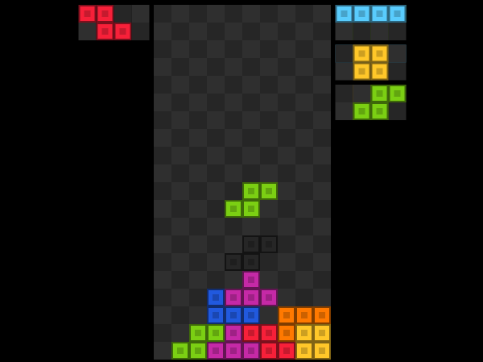

# tetris

Simple and extensible Tetris game for the browser

## [Play It](https://jstetris.vercel.app/)

[](https://jstetris.vercel.app/)

## Contribute

```sh
# Install yarn
npm install -g yarn

# Install the project dependencies
yarn install
```

With VSCode, use the extension prettier, and enable format on save.

### Develop

```
yarn parcel index.html
```

### About

- `jst` stands for _jsTetris_, the original name of the project
- `crd` stands for canvas renderer
